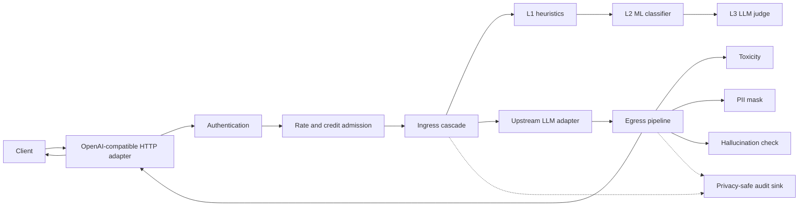
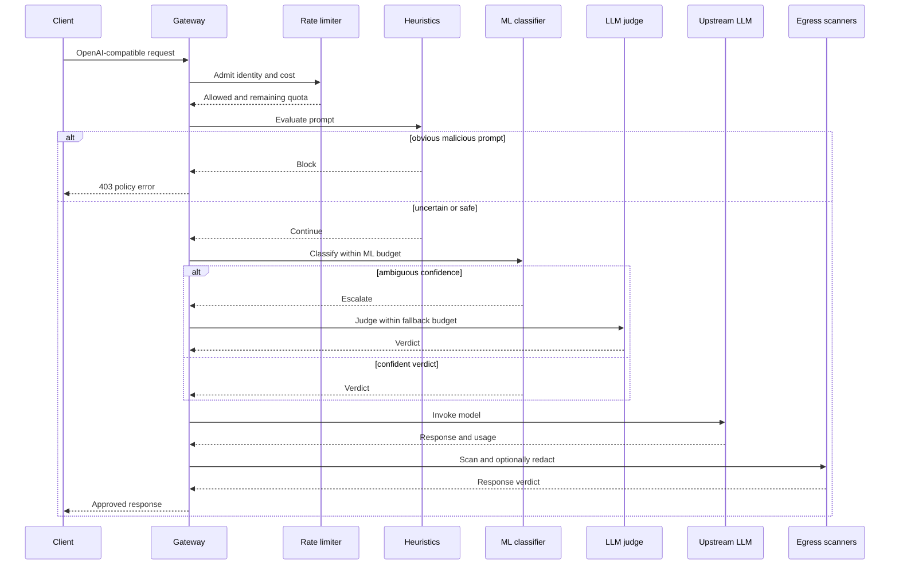

# Echelon

Echelon is an OpenAI-compatible, low-latency API gateway and AI security
firewall written in Go. It evaluates prompts before they reach an LLM, scans
model responses before they leave the trust boundary, and provides the quota and
credit controls needed to keep model usage safe and predictable.

> Build status: Phases 1–3 complete; Phase 4 (rate-limit/auth/credit) and Phase 5
> (API/provider wiring) are functionally done — auth → quota → ingress cascade →
> upstream → egress is composed end-to-end and verified live, including an ML
> classifier + LLM-judge escalation cascade on the **egress** path (response
> scanning), console telemetry (`/v1/console/*`), and a Docker/Compose stack.
> Remaining before Phase 5 closes: the transport-independent use-case extraction
> and a non-buffered streaming security mode. Phase 6 (Prometheus/OTel metrics,
> Redis-backed distributed rate-limit/credit, k8s manifests, fuzzing/race
> testing, SLOs) has not started. See [`EXECUTION_PLAN.md`](EXECUTION_PLAN.md)
> for the live build ledger and the root [`DEMO.md`](../DEMO.md) for the
> verified end-to-end contracts and honest limitations.

## Architecture

The code follows hexagonal boundaries: provider-neutral models live in
`internal/core`, dependency contracts live in `internal/ports`, application
pipelines coordinate those contracts, and adapters own HTTP, Redis, classifier,
and LLM-provider details. Plugins are constructed once at startup and are safe
for concurrent use.



The intended request path uses one global deadline. Each remote stage receives a
smaller child deadline and the cascade short-circuits as soon as policy reaches a
terminal decision.



## Repository layout

```text
cmd/server/          executable and dependency composition
internal/config/     validated environment configuration
internal/core/       transport- and provider-neutral domain model
internal/ports/      plugin interfaces for security and infrastructure
internal/ingress/    gated heuristic, ML classifier, and LLM-judge cascade
internal/egress/     toxicity/policy/PII scanners and isolated composition
internal/guard/      prototype local guards (migrated in Phase 2)
internal/gateway/    prototype HTTP adapter (application wiring in Phase 5)
```

## Run locally

Go 1.24 or newer is required (bumped from 1.22 by the Redis client/test
dependencies added in Phase 4).

```sh
cp .env.example .env
set -a; . ./.env; set +a
go test ./...
go run ./cmd/server
```

Check liveness and run a local prompt preflight:

```sh
curl -sS http://localhost:8080/healthz

curl -sS http://localhost:8080/v1/guard/preflight \
  -H 'Content-Type: application/json' \
  -d '{"messages":[{"role":"user","content":"hello"}]}'
```

Set `PROVIDER_OPENAI_API_KEY` (or the respective provider's key) before proxying provider requests. Echelon replaces an
inbound authorization header with this provider credential; it never exposes the
configured value through readiness or admin responses.

## HTTP surface

| Method | Path | Purpose |
| --- | --- | --- |
| `GET` | `/healthz` | Process liveness. |
| `GET` | `/readyz` | Redacted runtime readiness. |
| `GET` | `/admin/config` | Redacted configuration summary. |
| `GET` | `/admin/guards` | Enabled prompt and output plugins. |
| `POST` | `/v1/guard/preflight` | Prompt checks without an upstream call. |
| `POST` | `/v1/guard/output-scan` | Output checks without an upstream call. |
| `GET` | `/v1/models` | Proxied OpenAI-compatible model listing. |
| `POST` | `/v1/chat/completions` | Guarded chat completions. |
| `POST` | `/v1/responses` | Guarded Responses API call. |

## Configuration

The checked-in `.env.example` lists every operational setting. Important groups
are:

| Group | Variables |
| --- | --- |
| Server | `HTTP_ADDR`, `REQUEST_TIMEOUT`, `HTTP_*_TIMEOUT`, `SHUTDOWN_TIMEOUT` |
| Provider | `PROVIDER_*_BASE_URL`, `PROVIDER_*_API_KEY`, `DEFAULT_PROVIDER`, `MODEL_ROUTES` |
| Security | `UPSTREAM_TIMEOUT`, `HTTP_*_TIMEOUT`, `SHUTDOWN_TIMEOUT`, `SYSTEM_CANARY` |
| Cascade | `HEURISTIC_TIMEOUT`, `ML_TIMEOUT`, `JUDGE_TIMEOUT`, `EGRESS_TIMEOUT` |
| Classifiers | `ML_BASE_URL`, `JUDGE_BASE_URL`, `ML_*_THRESHOLD` |
| Failure policy | `SECURITY_FAIL_CLOSED` |
| Quota | `RATE_LIMIT_BACKEND`, `REDIS_URL`, `RATE_LIMIT_*` |

Configuration is rejected at startup if URLs are malformed, thresholds are
inverted, Redis is selected without a URL, values are non-positive, or the global
request budget cannot contain the configured sequential stage budgets.

## Design constraints

- Raw prompt and response content must not appear in logs or audit records.
- Network classifiers are optional adapters, not domain dependencies.
- Credit usage uses reserve/commit/release semantics and idempotency keys.
- Redis admission is atomic; the in-memory limiter is development-only.
- Streaming needs an explicit security mode because content cannot be both fully
  scanned and immediately forwarded. Phase 5 will expose that tradeoff rather
  than silently weakening egress guarantees.
